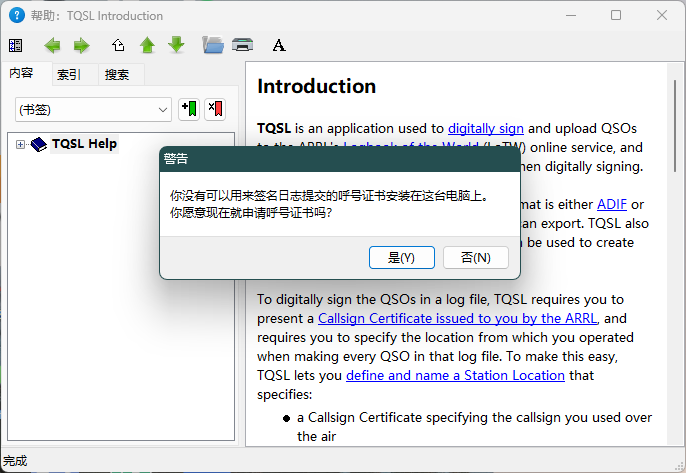
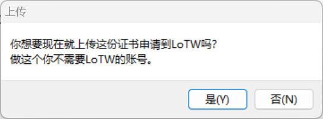

LOTW 是 ARRL 提供的一个业余无线电日志系统，允许用户上传和下载电子日志。它是一个非常方便的工具，可以帮助你管理和验证你的 QSO 记录。许多 DXCC 奖励和其他奖项都可以通过 LOTW 来申请。

首先下载并安装 [TQSL](http://www.arrl.org/tqsl-download) 软件，首次打开后会提示你申请一个呼号证书。

如果你不小心关掉了这个窗口，也可以在菜单栏 `呼号证书` -> `申请新呼号证书...` 进行申请。

然后填写呼号、DXCC 实体和有效期等信息。注意：如果你还会继续使用这个呼号，请留空最后一个 QSO 的日期。

完成后，在下一个页面填写姓名和台站位置等信息。

最后填写你的电子邮箱地址，这个邮箱地址将用于接收证书和密码，请务必保证邮箱的有效性。

完成后，将会提示是否现在上传证书申请，选择 `是` 即可。如果选择了 `否`，将会在本地生成一个 `.tq5` 文件，后续可以在 `呼号证书` -> `上传证书申请...` 中进行上传。

上传申请后，你会收到一封来自 lotw-admin@arrl.org 的邮件，提示你需要进一步提供身份证明。只需要将

- 身份证明文件（如身份证、护照等）
- 业余电台操作证书
- 无线电台执照

三个文件的电子版发送到 lotw-help@arrl.org 即可。个人敏感信息部分可以打码处理。

一般会在申请的当天或第二个工作日收到回复邮件。里面将会包含个人信息、 LoTW 账号密码和呼号证书 `.tq6` 文件。
