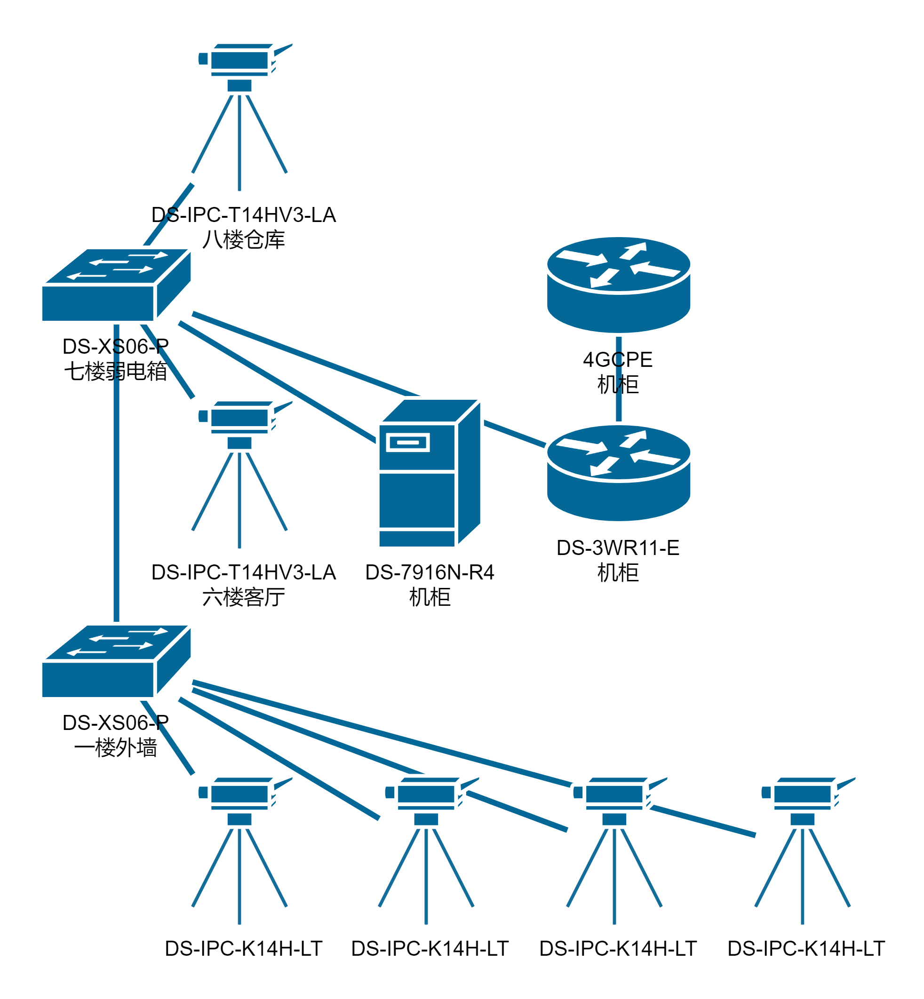

最近老家盖了新房，我负责整个房子的弱电事宜，包括监控、网络等。因为老家这一片还是工地，运营商的光纤还没接过来，所以打算趁着这次寒假先把监控网弄好，等光纤来了再接网络。

首先是整个屋子的布局，整体为八层，其中二楼到五楼是用于出租的套房，六楼到七楼用于自住，八楼分为仓库和露台部分。原本打算最好是：

- 一楼前后门各放两个监控对照
- 七楼客厅放一个监控
- 八楼仓库放两个监控
- 电梯轿厢内放一个监控

但是由于之前布线的时候缺了一些地方，所以八楼目前只留了一个监控线，不过后续应该也可以放一些支持 WiFi 的监控。电梯轿厢内原本打算使用无线网桥通过电梯机房的网络来接入，但是因为工程量有点大暂时还没有弄。

## 设备选择

随便看了一下网上的评论，打算直接使用海康威视的监控系统了，因为一个是在很多地方见过，另一个就是感觉品牌挺大的，应该质量上不会有什么问题（省得后续经常爬上爬下检修）。最后在某东一套下来选择了：

- 一楼 4 个枪机：DS-IPC-K14H-LT，4mm 焦距，400 万像素，红白双光，支持对讲，PoE 供电
- 六楼和八楼 2 个球机：DS-IPC-T14HV3-LA，2.8mm 焦距，400 万像素，红白双光，支持对讲，PoE 供电
- NVR 录像机安装在七楼机柜内：DS-7916N-R4，4 盘位 16 路，双网口
- 四个西数 8T 紫盘，7200RPM
- 两个 PoE 交换机：DS-XS06-P，4 口 PoE+2 口非 PoE，35W Max
- 另外店铺赠送了一个 DS-3WR11-E 百兆路由器，在后面起到了大用

粗略计算了一下，400 万像素的摄像机 1T 可以用 25 天，我的需求是存储 50 天的视频，然后再考虑到后续可能会增设摄像头，所以就选择了 4x8T 的组合。有趣的是，一开始差点是直接顺带买海康录像机附带的希捷硬盘的，但是突然发现店铺里一个 8T 盘要 1500r，但是隔壁 8T 紫盘只需要 670r，于是果断选择了紫盘。另外，一个摄像头最大需要使用 8Mbps 网络和 8.5W 功率，所以使用上面的交换机是刚好足够的。

之前提到的没有光纤宽带接入，所以还在某鱼上花 37r 购入了一台 4GCPE（至于为什么不选择 5GCPE，答案就是十倍的差价，太贵了 🥺），然后在某宝上办了一个广电的流量卡配合使用。

## 线路设计

一楼四个角的监控直接通过墙面和外墙上监控箱内的交换机连接即可。然后监控箱内出一条总线连入电梯井，一路向上通到七楼弱电箱的交换机。七楼弱电箱的交换机除了和机柜的录像机连接外，还负责连接六楼和八楼的两个球机。

## 实际安装

首先来一张全家福：

图中缺少了 4GCPE，此时还没到货。显示器原本打算去附近电脑店随便收一个百元破烂的，但是一个二手 24 寸 1080p 都要价 400r，只能作罢，于是立即某多多 392r 购入全新创维 23.8 寸 1080p，甚至还是 180 高刷。

一楼的枪机，搭了两个架子刚好可以坐起来慢慢弄，省了不少力气。此外，海康的每个摄像头都提供了钻孔示意贴纸，安装起来还是很方便的。

在弱电箱里疯狂压水晶头中……第一次体会到不按标准压水晶头有多爽。

其实每一层的弱电箱都是联通的，监控主线可以从这里过。但是之前预埋光纤的时候已经占用了不少空间，再加上之后可能打算在电梯井里安装无线网桥，所以选择了走电梯井。

最后来一张还不存在的机柜照片，等下次放假的时候再把机柜和桌子装上吧。显示器附赠的 DP 线，但是录像机只有 HDMI 接口，只能后续再去买 HDMI 线了。

虽然最后没用成显示器，但是可以全程通过手机上的易调试软件来配置。简单按照提示激活设备，设置密码，调节通道就大功告成了。看网上说萤石云广告很多，我这里就使用了海康互联 APP，然后将设备分享给家人，就可以远程查看了。

在配置设备的时候遇到了一个坑，海康的录像机和摄像头必须联网配置才会正常，之前流量卡和显示器都没到的时候只能拿着海康的易调试软件疯狂报错，后面打算搞监控网分离的时候也是摄像头可以查看画面，但是录像机死活连接不上去，最后把监控网也联网之后就瞬间正常了，如果需要搞内网隔离的话可能需要注意一下。
