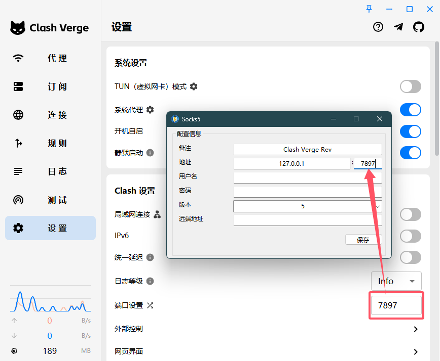

对于 GTAOL、地平线 5 等 p2p 游戏来说，如果不使用加速器很容易掉线或者联机失败，然而专业的游戏加速器常常具有比较高昂的月租费用。常见的 Clash 等客户端软件的 TUN 模式对游戏的加速效果不是很显著，依然会经常掉线卡顿，可以尝试使用 [Netch](https://github.com/netchx/netch) 来代理游戏进程的全部流量从而达到加速的目的。

## 直接使用订阅链接

点击 `订阅` → `管理订阅`，将自己的订阅链接添加到 Netch 中，并更新服务器。

Netch 仅支持 Vless、VMess、Shadowsock、Trojan 和 WireGuard 协议，选择好相应的服务器和模式后点击即可代理相应的流量，窗口右下角会显示相应的延迟以及 NAT 类型。如果显示 NoUDP 可能是不支持对应的协议或是节点不支持 UDP，可以尝试更换节点。

配置完成后可以按住 Ctrl 点击下方的按钮保存配置，下次直接点击就能加载对应的配置。

## 手动添加服务器

对于 Netch 不支持的协议，可以通过 Clash Verge Rev 等工具提供的 Socks5 协议来中转。

点击 `服务器` → `添加 [SOCKS] 服务器`，填入相应的信息即可正常使用。

