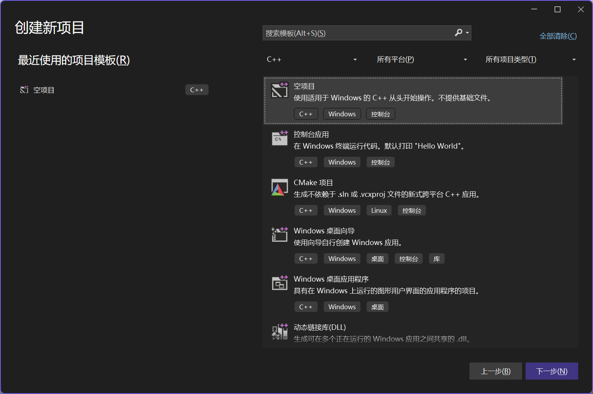
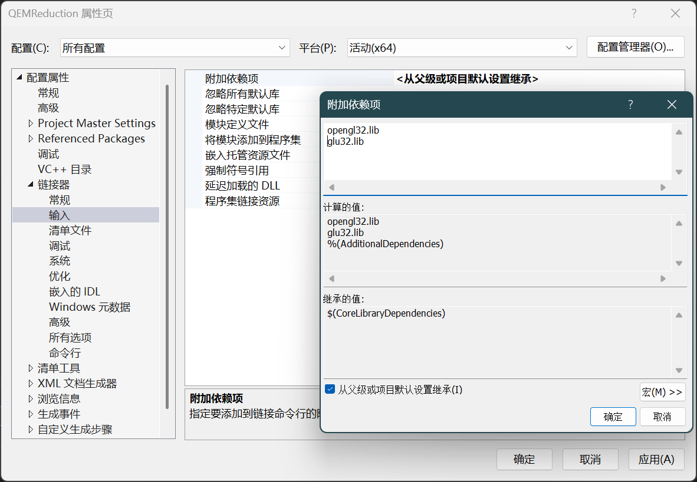
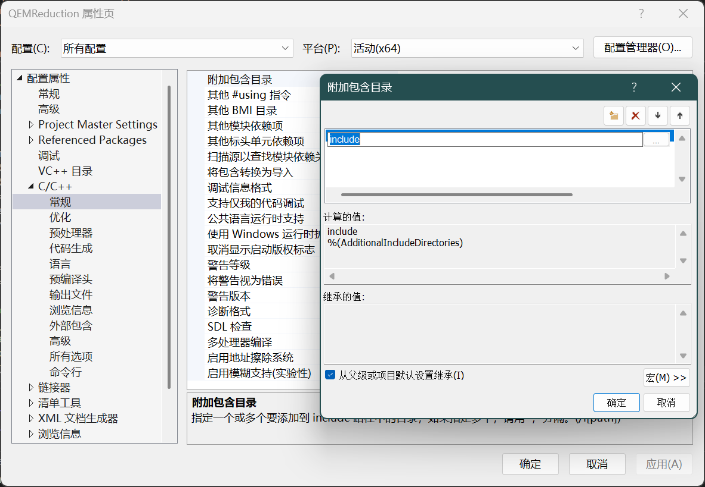

最近因学校可视化相关课程的需要，要求使用 C++ 和 OpenGL 开发可视化相关项目。因为是学校大作业项目，所以能尽量快速方便肯定是最好的，在此记录一下如何快速初始化好一个 VS C++ OpenGL 项目，方便后续使用。

首先确保你已在 Visual Studio Installer 中安装了以下组件：

- Visual Studio 2022 17.13.5 or higher
- 使用 C++ 的桌面开发（MSVC v143）
- Windows 10 SDK (10.0.22000.0) or higher

安装完成后，打开你的 Visual Studio 2022，选择创建新项目，然后选择 `C++` 语言，搜索 `空项目`，选择 `空项目` 模板，点击下一步。



之后输入项目名称和位置，因为是单项目，这里我就直接选择将解决方案和项目放在统一目录中了。

创建完成之后，就需要安装 OpenGL 相关的库了。显然我们不可能还手动把相关的库文件一个一个复制到项目里的，但是配置 vcpkg 对于一个作业项目来说又太麻烦了，所以我们直接使用 VS 自带的 NuGet 包管理器来安装 OpenGL 相关的库。

在菜单栏中点击 `项目` -> `管理 NuGet 程序包`，在打开的窗口中选择 `浏览` 选项卡，搜索并安装以下 NuGet 包：

- glew.v140：OpenGL 拓展封装库
- glfw：多平台窗口管理库
- glm：纯 C++ 实现的数学库，提供了向量、矩阵等数学运算
- Assimp：用于导入模型文件

安装完成之后，我们还要手动把系统中相关的库链接到项目中。右键点击项目，选择 `属性`，在打开的窗口中选择 `链接器` -> `输入`，在右侧的 `附加依赖项` 中添加以下库文件：

```bash
opengl32.lib
glu32.lib
```



注意配置要选择 `所有配置`，确保 Debug 和 Release 模式下都能使用。

然后编写一个简单的 OpenGL 程序来测试一下是否配置成功。我们可以在 `源文件` 目录下新建一个 `main.cpp` 文件，输入以下代码：

```cpp
#include <GL/glew.h>
#include <GLFW/glfw3.h>
#include <iostream>

void framebuffer_size_callback(GLFWwindow* window, int width, int height) {
    glViewport(0, 0, width, height);
}

void processInput(GLFWwindow* window) {
    if (glfwGetKey(window, GLFW_KEY_ESCAPE) == GLFW_PRESS)
        glfwSetWindowShouldClose(window, true);
}

int main() {
    if (!glfwInit()) {
        std::cerr << "Failed to initialize GLFW" << std::endl;
        return -1;
    }

    GLFWwindow* window = glfwCreateWindow(800, 600, "OpenGL Demo", NULL, NULL);
    if (window == NULL) {
        std::cerr << "Failed to create GLFW window" << std::endl;
        glfwTerminate();
        return -1;
    }
    glfwMakeContextCurrent(window);
    glfwSetFramebufferSizeCallback(window, framebuffer_size_callback);

    if (glewInit() != GLEW_OK) {
        std::cerr << "Failed to initialize GLEW" << std::endl;
        return -1;
    }

    while (!glfwWindowShouldClose(window)) {
        processInput(window);

        glClearColor(0.2f, 0.3f, 0.3f, 1.0f);
        glClear(GL_COLOR_BUFFER_BIT);

        glMatrixMode(GL_PROJECTION);
        glLoadIdentity();
        glMatrixMode(GL_MODELVIEW);
        glLoadIdentity();

        glBegin(GL_TRIANGLES);
            glColor3f(1.0f, 0.0f, 0.0f);  // 红色
            glVertex3f(-0.5f, -0.5f, 0.0f);
            glColor3f(0.0f, 1.0f, 0.0f);  // 绿色
            glVertex3f(0.5f, -0.5f, 0.0f);
            glColor3f(0.0f, 0.0f, 1.0f);  // 蓝色
            glVertex3f(0.0f, 0.5f, 0.0f);
        glEnd();

        glfwSwapBuffers(window);
        glfwPollEvents();
    }

    glfwTerminate();
    return 0;
}
```

点击上方的 `本地 Windows 调试器` 按钮，运行程序，如果看到一个窗口中显示了一个三角形，就说明配置成功了。

默认所有文件都放在根目录下比较杂乱，可以将源文件放在 `src` 文件夹下，头文件放在 `include` 文件夹下，资源文件放在 `res` 文件夹下。然后在项目属性中修改 `C/C++` -> `常规` -> `附加包含目录`，将 `include` 文件夹添加到其中。

