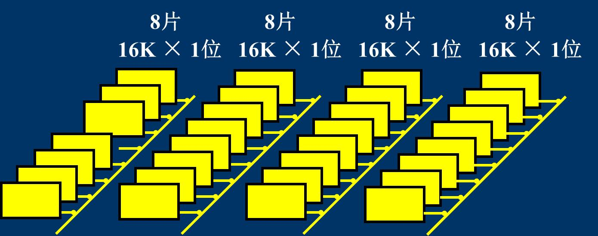

## 计算机系统概论

### 冯·诺依曼计算机的组成

冯·诺依曼计算机是一种采用存储程序方式工作的计算机，由硬件系统和软件系统组成。

**硬件系统**：由五大部件组成，分别是：运算器、控制器、存储器、输入设备和输出设备。

1. 运算器：负责算术运算和逻辑运算。
2. 控制器：负责控制整个计算机系统的运行。
3. 存储器：存放数据和指令。
4. 输入设备：将数据输入到计算机中。
5. 输出设备：将计算机处理的数据输出。

**软件系统**：由系统软件和应用软件组成。

### 冯·诺依曼计算机体系结构的特点

1. 冯·诺依曼计算机主要由五大部件组成，分别是：运算器、控制器、存储器、输入设备和输出设备；
2. 冯诺依曼体系结构的指令和数据均采用二进制码表示；
3. 指令和数据以同等地位存放于存储器中，均可按地址寻访；
4. 指令由操作码和地址码组成，操作码用来表示操作的性质，地址码用来表示操作数所在存储器中的位置；
5. 指令在存储器中按顺序存放，通常指令是按顺序执行的，特定条件下，可以根据运算结果或者设定的条件改变执行顺序；
6. 机器以运算器为中心，输入输出设备和存储器的数据传送通过运算器。

指令和数据都存于存储器中，计算机区分存储器中的指令和数据主要有两种方法：

1. 通过不同时间段来区分指令和数据，即在取指令阶段（或取值微指令）取出的为指令，在执行指令阶段（或相应微程序）取出的即为数据。
2. 通过地址来源区分，由 PC 提供存储单元地址的取出的是指令，由指令地址码部分提供存储单元地址的取出的是操作数。

术语：

- 主机：是计算机硬件的主体部分，由 CPU 和主存储器 MM 合成为主机。
- CPU：中央处理器，是计算机硬件的核心部件，由运算器和控制器组成；（早期的运算器和控制器不在同一芯片上，现在的 CPU 内除含有运算器和控制器外还集成了 CACHE）。
- 主存：计算机中存放正在运行的程序和数据的存储器，为计算机的主要工作存储器，可随机存取；由存储体、各种逻辑部件及控制电路组成。
- 存储单元：可存放一个机器字并具有特定存储地址的存储单位。
- 存储元件：存储一位二进制信息的物理元件，是存储器中最小的存储单位，又叫存储基元或存储元，不能单独存取。
- 存储字：一个存储单元所存二进制代码的逻辑单位。
- 存储字长：一个存储单元所存储的二进制代码的总位数。
- 存储容量：存储器中可存二进制代码的总量；（通常主、辅存容量分开描述）。
- 机器字长：指 CPU 一次能处理的二进制数据的位数，通常与 CPU 的寄存器位数有关。
- 指令字长：机器指令中二进制代码的总位数。

### 计算机硬件的主要技术指标

- 机器字长：指 CPU 一次能处理的二进制数据的位数，通常与 CPU 的寄存器位数有关。
- 运算速度：
  - 主频：CPU 内部振荡器的频率，通常以 MHz 或 GHz 为单位。
  - 吉普森法：$T_M = \Sigma_{i=1}^n f_i t_i$，其中 $f_i$ 为第 i 个操作的频率，$t_i$ 为第 i 个操作的时间。
  - MIPS：每秒百万条指令数。
  - CPI：每条指令的平均时钟周期数。
  - FLOPS：每秒浮点运算次数。
- 存储容量：存储器中可存二进制代码的总量。
  - 主存容量：
    - 存储单元数 MAR × 存储字长 MDR。
    - 2^字节数。
  - 辅存容量

阿姆达尔定律：

$$
\mathrm{Speedup} = \frac{T_1}{T_2} = \frac{1}{(1 - f) + \frac{f}{n}}
$$

其中 $T_1$ 为在单个处理器上的执行时间，$T_2$ 为在 $n$ 个并行处理器上的执行时间，$f$ 为原系统中需要改进的部分所占的比例，$n$ 为改进后系统中改进部分的执行速度。

## 计算机的发展历程

硬件技术对计算机更新换代的影响：

1. 电子管计算机（1946-1957）：40,000 次运算/秒。
2. 晶体管计算机（1958-1963）：200,000 次运算/秒。
3. 中小规模集成电路计算机（1964-1971）：1,000,000 次运算/秒。
4. 大规模集成电路计算机（1972-1977）：10,000,000 次运算/秒。
5. 超大规模集成电路计算机（1978-至今）：100,000,000 次运算/秒。

世界上第一台电子计算机：ENIAC（1946 年 2 月 14 日）。

E 级计算：每秒可进行百亿亿次运算。

## 系统总线

总线是连接各个部件的信息传输线，是各个部件共享的传输介质。

### 总线的分类

- 片内总线：芯片内部的总线。
- 系统总线：计算机各部件之间的信息传输线：
  - 数据总线：双向，与机器字长和存储字长有关。
  - 地址总线：单向，与存储地址、IO 地址有关。
  - 控制总线：双向，与控制信息有关，如终端请求、总线请求等。
- 通信总线：用于计算机系统之间或计算机系统与其他系统之间的通信。

常见的系统总线：

- ISA：Industry Standard Architecture，工业标准体系结构。
- VESA：Video Electronics Standards Association，视频电子标准协会。
- PCI：Peripheral Component Interconnect，外围设备互连。
- PCI-E：PCI Express，外围设备互连扩展。

常见的 IO 总线：

- IDE：Integrated Drive Electronics，集成驱动器电子技术。
- SCSI：Small Computer System Interface，小型计算机系统接口。
- USB：Universal Serial Bus，通用串行总线。
- IEEE-1394：FireWire，高速串行总线。

常见的通信总线：

- RS-232C：Recommended Standard 232C，推荐标准 232C，串行通信总线。
- IEEE-484：通用仪器总线，并行通信总线。

总线的性能指标：

- 总线宽度：数据总线的位数，也就是数据线的根数。
- 传输速率：数据总线的传输速率，通常以 MB/s 为单位。
- 时钟同步：总线的时钟信号同步/异步。
- 总线复用：是否将地址线与数据线复用。
- 信号线数：地址线、数据线、控制线的总数。
- 控制方式：总线的控制方式，如并发、自动、仲裁、逻辑、计数等。

### 总线结构

单总线结构：CPU 与主存、I/O 设备之间通过同一总线进行数据传输，这样可以提高 CPU 的效率，但是会降低总线的传输速率。

面向 CPU 的双总线结构：其中 M 总线为存储总线，各 I/O 设备通过 I/O 总线与 CPU 通信。但是 I/O 设备与主存之间的数据传输需要通过 CPU，这样会降低 CPU 的效率。

以存储器为中心的双总线结构：在单总线结构的基础上增加一条 CPU 与主存之间的总线，这样可以提高 CPU 的效率，同时也提高了总线的传输速率。

三总线结构：任意时刻只有一条总线处于工作状态，主存总线和 DMA 总线不能同时读取主存，当 CPU 执行 I/O 指令时才会使用 I/O 总线。

另一种三总线结构：CPU 和 Cache 以及一些局部设备通过局部总线连接，Cache 可直接通过系统总线访问主存，其他设备通过拓展总线和拓展总线接口与系统总线连接。

四总线结构：增加一条高速总线与高速设备相连，拓展设备通过拓展总线结构接入高速总线，可以让高速设备与 CPU 的联系更加密切。

### 总线判优控制

主模块对总线有控制权，从模块响应主设备的总线命令。集中式将控制逻辑集中在一处（如链式查询、计数器定时查询、独立请求方式），分布式将控制逻辑分散在各个设备中。

链式查询方式：当设备发出 BR 信号后，总线控制部件发出 BG 信号，从离 CPU 最近的设备开始逐渐传递，知道到达的接口有总线请求便停止传递 BG 信号，此时该设备获得总线使用权并发出 BS 信号表示占用总线。这种方式易于拓展设备，但对电路故障敏感。

计数器定时查询方式：总线收到 BR 信号后，当 BS=0 未被使用时，总线计数器发出设备地址信号，与地址匹配的设备获得总线使用权，并发出 BS 信号结束计数器。这种方式对电路故障较不敏感，但控制较复杂。

独立请求方式：每个设备均有一对总线请求线 BR_i 和总线同意线 BG_i。总线内有排队电路，可以根据设定的优先次序决定响应的设备。这种方法响应速度快，但控制线非常多。

### 总线通信控制

总线通信控制是为了解决通信双方协调配合的问题。

总线传输周期：

- 申请阶段（T1）：主模块申请，总线仲裁决定。
- 寻址阶段（T2）：主模块发出地址和命令。
- 传数阶段（T3）：主模块和从模块蒋欢数据。
- 结束阶段（T4）：主模块撤销相关信号。

总线通信控制方式：

同步通信：由统一时标控制数据传送。

异步通信：采用应答方式控制数据传送。

- 不互锁方式：主模块发出请求信号后，不等待从模块的应答信号，而是等待一段时间后确认从模块收到信号后撤销请求信号。
- 半互锁方式：主模块发出请求信号后，等待从模块的应答信号，从模块收到请求信号后发出应答信号，主模块收到应答信号后撤销请求信号。
- 全互锁方式：主模块发出请求信号后，等待从模块的应答信号，从模块收到请求信号后发出应答信号，主模块收到应答信号后撤销请求信号，从模块收到撤销信号后撤销应答信号。

波特率：单位时间内传输的二进制数据的位数。

比特率：单位时间内传输的二进制有效数据的位数。

半同步通信：发送方用系统时钟前沿触发，接收方用数据时钟前沿触发。对于不同设备的模块，增加一条等待响应信号 $\overline{\mathrm{WAIT}}$。

分离式通信：上面三种方式在从模块准备数据的时候总线是空闲的，所以可以使用分离式通信进一步提高总线的利用率。分离式通信将一个总线传输周期分为两个子周期，在子周期 1 时，主模块申请占用总线，将命令和地址发送后立即释放总线，从模块在子周期 2 时将数据发送给主模块。

分离式通信的特点：

- 各模块都有权申请占用总线。
- 使用同步方式通信，不需要等待对方应答。
- 各模块准备数据的时候不需要占用总线。
- 总线被占用的时候不会被空闲。

## 存储器

存储器按存储介质可分为：

- 半导体存储器：TTL（双极型半导体存储器）、MOS，易失性存储器。
- 磁表面存储器：磁头在载磁体上做读写操作，非易失性存储器。
- 磁芯存储器：硬磁材料制成的环状元件，非易失性存储器。
- 光盘存储器：利用激光技术在磁光材料上进行读写操作，非易失性存储器。

存储器按存取方式可分为：

- 随机存储器（RAM）：存取时间与地址无关，断电后数据丢失。
  - 静态 RAM（SRAM）：触发器原理，存取速度快，价格高，主要用于缓存。
  - 动态 RAM（DRAM）：电容原理，存取速度慢，价格低，主要用于主存。
- 只读存储器（ROM）：只读，断电后数据不丢失。
  - PROM：可编程只读存储器，通过熔丝方式编程，只能一次性编程。
  - EPROM：可擦除可编程只读存储器，通过紫外线擦除。
  - EEPROM：电可擦除可编程只读存储器。
  - Flash Memory：闪存，具有 EEPROM 的特点，但是擦写速度更快。
- 串行访问存储器：存取时间与地址有关，断电后数据不丢失。
  - 顺序存取存储器：磁带存储器，必须从头开始按顺序读取。
  - 直接存取存储器：磁盘存储器，先找到数据所在的磁道，再顺序读取。

存储器按作用可分为：

- 主存储器：可以直接和 CPU 交换信息。
  - RAM：静态 RAM、动态 RAM。
  - ROM：PROM、EPROM、EEPROM。
- Flash Memory：闪存。
- Cache Memory：高速缓冲存储器，存放 CPU 频繁访问的数据和指令。
- 辅助存储器：磁盘、磁带、光盘等，用于长期存储数据。

存储器的层次结构：

<table>
  <tr>
    <th>类型</th>
    <th>位置</th>
    <th>速度</th>
    <th>容量</th>
    <th>价格</th>
  </tr>
  <tr>
    <td>寄存器</td>
    <td rowspan="2">CPU</td>
    <td rowspan="6">快→慢</td>
    <td rowspan="6">小→大</td>
    <td rowspan="6">高→低</td>
  </tr>
  <tr>
    <td>缓存</td>
  </tr>
  <tr>
    <td>主存</td>
    <td>主机</td>
  </tr>
  <tr>
    <td>磁盘</td>
    <td rowspan="3">辅存</td>
  </tr>
  <tr>
    <td>光盘</td>
  </tr>
  <tr>
    <td>磁带</td>
  </tr>
</table>

### 主存储器

一个八位二进制数表示一个字节，存储器可按照字节地址和字地址编码。

以下表 IBM 370 为例，其字长为 32 位，字地址为该字的高位字节地址。若地址线为 24 根，则其按字节寻址范围为 2^24=16M，按字寻址为 4M。

<table>
  <tr>
    <th>字地址</th>
    <th colspan="4">字节地址</th>
  </tr>
  <tr>
    <td>0</td>
    <td>0</td>
    <td>1</td>
    <td>2</td>
    <td>3</td>
  </tr>
  <tr>
    <td>4</td>
    <td>4</td>
    <td>5</td>
    <td>6</td>
    <td>7</td>
  </tr>
  <tr>
    <td>8</td>
    <td>8</td>
    <td>9</td>
    <td>10</td>
    <td>11</td>
  </tr>
</table>

再以下表的 PDP-11 为例，其字长为 16 位，字地址为该字的低位字节地址。若地址线为 16 根，则其按字节寻址范围为 2^16=64K，按字寻址为 32K。

<table>
<tr>
<th>字地址</th>
<th colspan="2">字节地址</th>
</tr>
<tr>
<td>0</td>
<td>1</td>
<td>0</td>
</tr>
<tr>
<td>2</td>
<td>3</td>
<td>2</td>
</tr>
<tr>
<td>4</td>
<td>5</td>
<td>4</td>
</tr>
</table>

主存的技术指标：

- 存储容量：主存存放二进制代码的总位数。存储容量=存储单元个数 × 存储字长。
- 存储速度：
  - 存储时间：存储器的访问时间，分为读取时间和写入时间。
  - 存储周期：连续两次独立的存储器操作的最小时间间隔。
- 存储器带宽：单位时间存储器存取的信息量。

#### 存储芯片的片选

如图，用 32 片 16K×1 位的存储器构成一个 64K×8 位的存储器，当地址为 65535 时，最右侧 8 篇的片选有效。

半导体存储芯片的译码驱动方式：

线选法：用一根字选择线直接选中一个存储单元的所有位。结构简单但是线数多。

重合法：用两个译码器分别选中矩阵的行和列，选中一个存储单元的一个位。线数少但是结构复杂。

动态 RAM 的刷新：由于电容的漏电，需要定时刷新电容的电荷。

- 集中刷新：一段时间内集中刷新所有存储单元。在刷新期间不能进行读写操作。
- 分散刷新：在每个存取周期中刷新一行存储单元。刷新时间分散，但存取周期变长了。
- 异步刷新：充分利用最大刷新周期，例如最大刷新周期为 2ms，存储芯片为 128×128，则可以每隔 2ms÷128=15.625μs 刷新一行。如果将刷新时间安排在 CPU 译码阶段，则可以完全不影响读写操作。

#### 存储器与 CPU 的连接

#### 存储器的校验

编码的最小距离：任意两组合法代码之间二进制位数的最少差异编码的纠错、检错能力与编码的最小距离有关。即：

$$
L-1=D+C \quad (D \ge C)
$$

其中 $L$ 为编码的最小距离，$D$ 为检测错误的位数，$C$ 为纠正错误的位数。

设欲检测 $n$ 位二进制代码，需要添加 $k$ 位校验码，则汉明码满足关系：

$$
2^k \ge n+k+1
$$

设 $n+k$ 位代码自左向右依次编码为第 $1,2,3,\cdots,n+k$ 位，则汉明码的校验位 $C_i$ 分别安插在第 $1,2,4,8,\cdots, 2^{k-1}$ 位上，且：

- $C_1$ 检测的 $g_1$ 小组包含第 $1,3,5,7,9,11,\cdots$ 位
- $C_2$ 检测的 $g_2$ 小组包含第 $2,3,6,7,10,11,14,15\cdots$ 位
- $C_4$ 检测的 $g_3$ 小组包含第 $4,5,6,7,12,13,14,15\cdots$ 位
- $C_8$ 检测的 $g_4$ 小组包含第 $8,9,10,11,12,13,14,15,24\cdots$ 位

这种划分的特点是：

- 每个 $g_i$ 小组检测的第 $2^{i-1}$ 是其他小组都没有的
- 每两个小组 $g_i, g_j$ 共同检测的 $2^{i-1}+2^{j-1}$ 是其他两小组都没有的
- 每三个小组 $g_i, g_j, g_k$ 共同检测的 $2^{i-1}+2^{j-1}+2^{k-1}$ 是其他三小组都没有的
- 以此类推

若使用配偶原则（偶校验），则校验位应使得每个 $g_i$ 小组中 1 的个数为偶数；若使用奇校验，则校验位应使得每个 $g_i$ 小组中 1 的个数为奇数。

例如对于 0101，按偶校验配置的汉明码为：

| 序号 | 1     | 2     | 3   | 4     | 5   | 6   | 7   |
| ---- | ----- | ----- | --- | ----- | --- | --- | --- |
| 数据 | $C_1$ | $C_2$ | 0   | $C_4$ | 0   | 1   | 0   |
|      | 0     | 1     |     | 0     |

汉明码的纠错过程：

对传输后的汉明码形成新的检测位 $P_i$，$P_i$ 由原小组内 1 的个数决定，若检测位 $P_i$ 与传输后的检测位 $C_i$ 不同，则说明出现错误。如果使用偶校验，那么出错的那一位即为第 $P_i \cdots P_4 P_2 P_1$ 位，将其翻转即可。

#### 提高访存速度的措施

- 采用高速器件
- 采用层次结构：Cache-主存
- 调整主存结构

单体多字系统

多体并行系统

- 高位交叉：各个体并行工作
- 低位交叉：各个体轮流编址

### 高速缓存存储器

主存和缓存的编址：

Cache 性能指标：

- 命中率：$h=\frac{N_c}{N_c+N_m}$，其中 $N_c$ 为 Cache 命中次数，$N_m$ 为 Cache 不命中次数。
- 平均访问时间：$t_a=ht_c+(1-h)t_m \times 100% $，其中 $t_c$ 为 Cache 访问时间，$t_m$ 为主存访问时间。
- Cache 利用效率：e=访问 Cache 的时间 ÷ 平均访问时间。
- 加速比：s_p=无 Cache 的时间 ÷ 平均访问时间。

Cache 写策略：

- 写直达法：写 Cache 同时写主存。
- 写回法：写 Cache 不写主存，当 Cache 被替换时再写回主存。需要再增加一个脏位标志。

#### Cache-主存地址映射

直接映射：每个缓存块 $i$ 可以和若干个主存块 $j$ 对应，$i=j \bmod C$，其中 $C$ 为 Cache 块数。但每个主存块 $j$ 只会和一个缓存块 $i$ 对应。

全相联映射：主存的任一块可以映射到缓存的任一块。

组相联映射：主存的任一块只能映射到缓存的某一组。

#### 替换策略

- 先进先出（FIFO）：最先进入的块最先被替换。
- 最近最少使用（LRU）：最近最少使用的块被替换。
- 随机法：随机选择一个块替换。

### 辅助存储器

磁表面存储器的主要技术指标：

- 记录密度：$D_t=\frac{1}{P}$，其中 $D_t$ 为道密度，$P$ 为道距。
- 存储容量：$C=n \times k \times s$，其中 $n$ 为盘面数，$k$ 为磁道数，$s$ 为每个磁道的二进制代码数。
- 平均寻址时间：平均寻道时间+平均等待时间。
- 数据传输率：$D_r=D_b \times V$，其中 $D_r$ 为数据传输率，$D_b$ 为数据密度，$V$ 为磁盘转速。
- 误码率：出错信息位数与总读出信息位数之比。

循环冗余校验码（CRC）：

- 待编码数据用多项式 $M(x)$ 表示，$M(x)=D_{n-1}x^{n-1}+D_{n-2}x^{n-2}+\cdots+D_1x^1+D_0x^0$。
- 将信息码组左移 $k$ 位，得到 $M(x) \cdot x^k$，空出的 $k$ 位用于拼接校验码。$G(x)$ 的位数为 $k+1$。
- 用 $M(x) \cdot x^k$ 除以生成多项式 $G(x)$，得到余数为校验码 $R(x)$。$M(x) \cdot x^k + R(x)$ 即为 CRC 码。
- 纠错时，将收到的 CRC 码除以 $G(x)$，若余数为 0 则无错误，否则有错误。
- 对于 (7,4) 码，有以下的出错模式：
  | 余数 | 000 | 001 | 010 | 100 | 011 | 110 | 111 | 101 |
  | ------ | --- | --- | --- | --- | --- | --- | --- | --- |
  | 出错位 | 无 | 7 | 6 | 5 | 4 | 3 | 2 | 1 |

## 输入输出系统

输入输出系统的组成：

- I/O 软件
  - I/O 指令：属于 CPU 指令的一部分，一般格式为：操作码+命令码+设备码。
  - 通道指令：对具有通道的 I/O 系统专门设置的指令，用以指出数组的首地址、传送字数、操作命令等。
- I/O 硬件

I/O 设备编址方式：

- 统一编址：用取数、存数指令访问 I/O 设备。
- 不统一编址：用专门的 I/O 指令访问 I/O 设备。

设备选址：用设备选择电路识别设备是否被选中。

传送方式：串行或异步。

联络方式：

- 立即响应
- 异步工作采用应答信号
- 同步工作采用同步时标

I/O 设备与主机的连接方式：

- 辐射式连接：每台设备都配有一套控制线路和一组信号线，不便于增删设备。
- 总线连接：设备通过总线与主机连接，便于增删设备。

### I/O 接口

I/O 总线上包含：

- 数据线：一般等于存储字长的位数或字符的位数。一般是双向的，或使用两组单向数据线分别用于输入和输出。
- 设备选择线：用于传输设备码，用于选择 I/O 设备。
- 命令线：用于传输命令码，用于控制 I/O 设备。
- 状态线：用于传输 I/O 设备的状态信息。

I/O 接口的功能：

- 选址功能：设备选择电路。
- 传送命令功能：命令寄存器、命令译码器。
- 传送数据功能：数据缓冲寄存器。
- 反映设备状态的功能：设备状态标记。

I/O 接口的分类：

- 按数据传送方式分类：并行接口和串行接口。
- 按功能选择的灵活性分类：可编程接口和不可编程接口。
- 按通用性分类：通用接口和专用接口。
- 按数据传送的控制方式分类：程序型接口和 DMA 型接口。

### 信息传送控制方式

程序查询方式：CPU 和 I/O 串行工作踏步等待。

程序中断方式：CPU 和 I/O 并行工作，没有踏步等待现象，中断现行程序。

DMA 方式：主存和 I/O 之间有一条直接的数据通道，不中断现行程序，挪用主存存取周期，而 CPU 仍可进行内部运算。

## 计算机运算方式

### 无符号数与有符号数

- 无符号数：所有位均用于表示数值，没有符号位。
- 有符号数：最高位为符号位，0 表示正数，1 表示负数。
- 原码：最高位为符号位，其余位表示数值。
- 反码：正数的反码与原码相同，负数的反码为原码除符号位外各位取反。
- 补码：正数的补码与原码相同，负数的补码为反码加 1。
- 移码：正数的移码与原码相同，负数的移码为原码加上 $2^n$。将补码的符号位取反即可得到移码。

整数原码的定义：

$$
[x]_{\text{原}} =
\left\{
\begin{aligned}
0,x & \quad 2^n \gt x \ge 0 \\
2^n - x & \quad 0 \ge x \gt -2^n
\end{aligned}
\right.
$$

小数原码的定义：

$$
[x]_{\text{原}} =
\left\{
\begin{aligned}
x & \quad 1 \gt x \ge 0 \\
1 - x & \quad 0 \ge x \gt -1
\end{aligned}
\right.
$$

整数补码的定义：

$$
[x]_{\text{补}} =
\left\{
\begin{aligned}
0,x & \quad 2^n \gt x \ge 0 \\
2^{n+1} + x & \quad 0 \gt x \ge -2^n
\end{aligned}
\right.
$$

小数补码的定义：

$$
[x]_{\text{补}} =
\left\{
\begin{aligned}
x & \quad 1 \gt x \ge 0 \\
2 + x & \quad 0 \gt x \ge -1
\end{aligned}
\right.
$$

### 数的定点表示和浮点表示

浮点数表示为 $N=S \times r^j$，其中 $S$ 为尾数，$r$ 为基数，$j$ 为阶码。规定计算机中浮点数的尾数为纯小数，即小数点位于数符和第一数值之间。若位数最高位为 1 则为规格化数，规格化数的精度最高。

浮点数的规格化：当基数为 2 时，位数最高位为 1 的数为规格化数。左规：尾数左移，阶码加 1；右规：尾数右移，阶码减 1。

当浮点数尾数为 0 时，按机器零处理。当浮点数阶码小于或等于它所表示的最小数时，按机器零处理。

- 若阶码和位数都用补码表示，则机器零为：X,XXXX;0.0000 和 1,0000;X.XXXX。
- 若阶码用移码，尾数用补码表示，则机器零为：0,0000;0.0000。

十进制数转换为浮点数：整数部分不断除二取余，小数部分不断乘二取整。

IEEE 754 标准：尾数一般为规格化表示（也可以用非规格化表示），非零规格化数的有效位最高位隐含 1。阶码用移码表示

| 类型     | 数符 | 阶符+阶码 | 尾数 | 总位数 | 阶码偏移量 |
| -------- | ---- | --------- | ---- | ------ | ---------- |
| 短实数   | 1    | 8         | 23   | 32     | 7FH        |
| 长实数   | 1    | 11        | 52   | 64     | 3FFH       |
| 临时实数 | 1    | 15        | 64   | 80     | 3FFFH      |

IEEE 754 标准浮点数的特殊值：

| 偏移阶码 | 尾数 | 意义       |
| -------- | ---- | ---------- |
| 0        | 0    | ±0         |
| 0        | 非 0 | 非规格化数 |
| 1~254    | 任意 | 规格化数   |
| 255      | 0    | ±∞         |
| 255      | 非 0 | NaN        |

### 定点运算

#### 移位运算

| 真值 | 码制             | 添补代码           |
| ---- | ---------------- | ------------------ |
| 正数 | 原码、补码、反码 | 0                  |
| 负数 | 原码             | 0                  |
| 负数 | 补码             | 左移添 0，右移添 1 |
| 负数 | 反码             | 1                  |

#### 加法运算

- 整数：$[A+B]_\text{补} = [A]_\text{补} + [B]_\text{补}$
- 小数：$[A+B]_\text{补} = [A]_\text{补} + [B]_\text{补}$

#### 减法运算

- 整数：$[A-B]_\text{补} = [A]_\text{补} + [-B]_\text{补}$
- 小数：$[A-B]_\text{补} = [A]_\text{补} + [-B]_\text{补}$

其中 $[-B]_\text{补}$ 可由 $[B]_\text{补}$ 取反加 1 得到。

#### 溢出判断

- 一位符号位判断：参与运算的两个数符号相同，但与结果符号不同，则溢出。
- 两位符号位判断：两位符号位不同时则溢出。高位是真正的符号位。

#### 乘法运算

以 0.1101 ×0.1011 为例：

|                      部分积 | 乘数                      | 说明                                               |
| --------------------------: | ------------------------- | -------------------------------------------------- |
|           0.0000 +0.1101 | 101<u>1</u>         | 初始部分积为 0，乘数为 1 则加被乘数                |
| 0.1101 0.0110 +0.1101 | 110<u>1</u>               | 部分积和乘数同时右移，部分积右移溢出的数补到乘数上 |
| 1.0011 0.1001 +0.0000 | 1 111<u>0</u>    | 乘数为 0 则加 0                                    |
| 0.1001 0.0100 +0.1101 | 11 111<u>1</u>   | 乘数为 1 则加被乘数                                |
|            1.0001 0.1000 | 111 1111               | 最后右移 1 位得到结果                              |

**原码一位乘**：

乘积的符号位由两原码的符号位异或得到。乘积的数值由上面的方法确定。

设 $[x]_\text{原} = x_0.x_1 x_2 \cdots x_n, [y]_\text{原} = y_0.y_1 y_2 \cdots y_n$，则 $[x]_\text{原} \cdot [y]_\text{原} = x_0 \oplus y_0 . x^* y^*$。

其中 $x^* = 0.x_1 x_2 \cdots x_n, y^* = 0.y_1 y_2 \cdots y_n$，分别为 $x,y$ 的绝对值。

**Booth 算法**（补码一位乘）：

设 $[x]_\text{补} = x_0.x_1 x_2 \cdots x_n, [y]_\text{补} = y_0.y_1 y_2 \cdots y_n$，则

$$
[x \cdot y]_\text{补} = [x]_\text{补} (0.y_1 y_2 \cdots y_n) - [x]_\text{补} \cdot y_0
$$

由上式可知，当 $y_0 = 0$ 时乘数为正，无需校正；当 $y_0 = 1$ 时乘数为负，则需要再减去 $[x]_\text{补}$。

在 $\bmod 2$ 意义下，$[-x]_\text{补} = -[x]_\text{补}$。Booth 算法需要添加一位附加位$y_{n+1}$，初始值为 0，每一步由 $y_{i+1}-y_i$的值确定部分积的操作，除了最后一步外，每一步都要右移一位。

| $y_i y_{i+1}$ | $y_{i+1}-y_i$ | 操作                                    |
| ------------- | ------------- | --------------------------------------- |
| 00            | 0             | 部分积右移一位                          |
| 01            | 1             | 部分积加 $[x]_\text{补}$，然后右移一位  |
| 10            | -1            | 部分积加 $[-x]_\text{补}$，然后右移一位 |
| 11            | 0             | 部分积右移一位                          |

以 $[x]_\text{补} = 1.0101, [y]_\text{补} = 1.0011$ 为例：

|                                    部分积 | 乘数                                       | 附加位                           | 说明                                                                                                    |
| ----------------------------------------: | ------------------------------------------ | -------------------------------- | ------------------------------------------------------------------------------------------------------- |
|                       00.0000 +00.1011 | 1001<u>1</u>                         | <u>0</u>                   | 初始部分积和附加位均为 0 $y_n y_{n+1}$=10，部分积加 $[-x]_\text{补}$                                 |
| 00.1011 00.0101 00.0010 +11.0101 |  1100<u>1</u> 1110<u>0</u>     |  <u>1</u> <u>1</u>   |  部分积右移 1 位 $y_n y_{n+1}$=11，部分积右移 1 位 $y_n y_{n+1}$=01，部分积加 $[x]_\text{补}$  |
| 11.0111 11.1011 11.1101 +00.1011 | 11 1111<u>0</u> 1111<u>1</u>   |  <u>0</u> <u>0</u>   |  部分积右移 1 位 $y_n y_{n+1}$=00，部分积右移 1 位 $y_n y_{n+1}$=10，部分积加 $[-x]_\text{补}$ |
|                                   00.1000 | 1111                                       |                                  | 最后一步不移位                                                                                          |

#### 除法运算

**原码除法（恢复余数法）**：

每次都减去除数，如果结果为负数则加回去，然后被除数和商同时左移 1 位。商的符号位由被除数和除数的符号位异或得到。商的最高位可以用于溢出判断，若为 1 说明溢出，无法继续计算。

**原码除法（加减交替法）**：

恢复余数法在被除数是负数时需要加回除数，比较浪费时间。因为恢复余数和下一次试商的过程合起来是 $2(R_i+y^*)-y^*$，可以化简为 $2R_i+y^*$，所以可以通过下面的方法来减少这一次恢复的操作：

- 当余数 $R_i>0$ 时，上商 1，做 $2R_i-y^*$ 操作。
- 当余数 $R_i<0$ 时，上商 0，做 $2R_i+y^*$ 操作。

### 浮点运算

#### 加减运算

设两个浮点数 $x=S_x \cdot r^{j_x}, y=S_y \cdot r^{j_y}$，其中 $S_x,S_y$ 为尾数，$j_x,j_y$ 为阶码，$r$ 为基数。浮点数加减运算需要经过以下步骤：

**对阶**：将两个数的阶码对齐，先求出两树的阶差，然后将阶码较小的数的尾数右移阶差位。

**尾数相加**：将对阶后的两个尾数按定点运算的方法相加。

**规格化**：将尾数规格化。规格化数的判断：当 $r=2$ 时，$\frac12 \le S \lt 1$。

| S>0  | 规格化形式 | S<0  | 规格化形式 |
| ---- | ---------- | ---- | ---------- |
| 原码 | 0.1XXX     | 原码 | 1.1XXX     |
| 补码 | 0.1XXX     | 补码 | 1.0XXX     |
| 反码 | 0.1XXX     | 反码 | 1.0XXX     |

- 左规：当尾数出现 00.0XXX 或 11.1XXX 时，左规直到符合规格化数的形式。
- 右规：当尾数出现 01.XXXX 或 10.XXXX 时，说明尾数溢出，需要右规一位。

**舍入**：根据舍入规则舍入。

对阶和右规过程中会造成尾数低位丢失引起精度误差，可以通过舍入方法来提高精度。

- 0 舍 1 入法：丢弃位为 1 时则加 1。
- 恒置 1 法：右移后最低位设为 1。

**溢出判断**：根据阶码判断是否溢出。

- 阶码为 01,XXXX 时为上溢，需要中断处理。
- 阶码为 10,XXXX 时为下溢，当作机器零处理。

## 指令系统

## 中央处理器

## 控制单元
