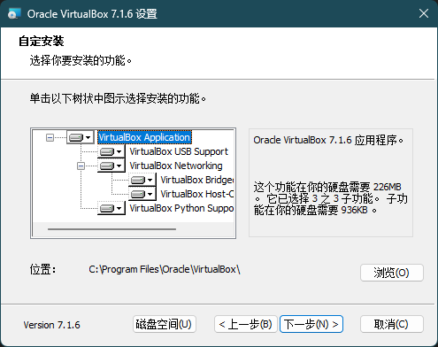
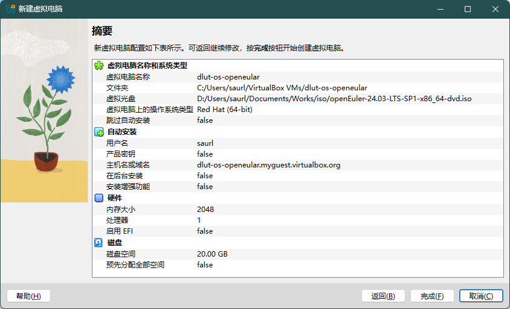
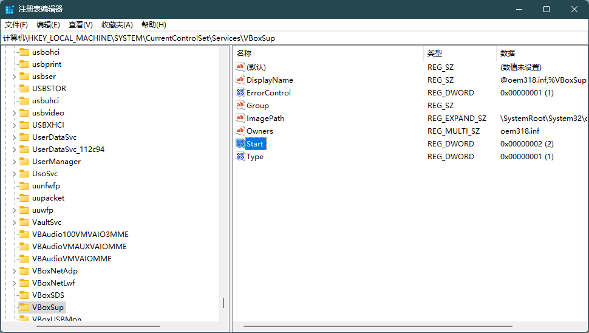

学校的操作系统课程要求使用 OpenEular，课程推荐使用 VirtualBox 安装。

首先下载并安装对应宿主机平台的 [VirtualBox](https://www.virtualbox.org/wiki/Downloads)。因为软件就算安装在其他盘也会在 C 盘释放一些必要文件，如果需要重装系统时，保留在其他盘的软件也会因为损失某些 C 盘文件而不可用；此外，安装在默认路径也方便搜索教程和查找问题，所以在这里我选择了默认路径安装。

在等待 VirtualBox 安装的过程中，可以先前往 [OpenEular](https://www.openeuler.org/zh/download/) 官网下载最新稳定版的镜像文件。

点击 VirtualBox 首页的新建虚拟机按钮，选择刚刚下载好的镜像文件。之后设置用户名密码、内存大小、硬盘大小等，最后点击创建。

可能是因为之前我使用过 WSL2 的原因，启动虚拟机时会报错 VERR_INVALID_NAME，检查后发现程序与功能中并没有启用 Hyper-V，所以可能是其他原因。

尝试了网上的一些办法，只需要将 `HKEY_LOCAL_MACHINE\SYSTEM\CurrentControlSet\Services\VBoxSup` 的 `Start` 值从 1 更改为 2 即可。重启后再进入虚拟机，就可以正常使用了。

