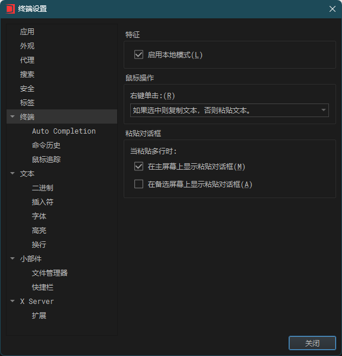

以前一直在直接使用 ssh 登录服务器，随着服务器越来越多，经常会忘记密码。此外在操作服务器时经常会遇到需要上传和下载文件的情况，所以在寻找一款同时具有 ssh 和 sftp 功能的终端。以前尝试过 FinalShell，但是其多了很多不太需要的功能，所以最终选择了 [WindTerm](https://github.com/kingToolbox/WindTerm)。

## 配置

打开软件后，在左侧会话标签页中可以查看和连接已保存的会话。右键点击会话可以新建会话。在新建时可以选择终端类型为 xterm-256color，这样可以正常显示颜色。其次，还可以设置 OneKey，这样在终端中遇到需要输入密码的情况时，可以直接点击 OneKey 输入密码。此外，同一个 OneKey 还可以应用到不同的服务器/会话上。

**右键复制粘贴**

在会话-首选项-设置菜单中，点击终端选项卡，在鼠标操作-右键单击选择框中选择“如果选中则复制文本，否则粘贴文本”。

