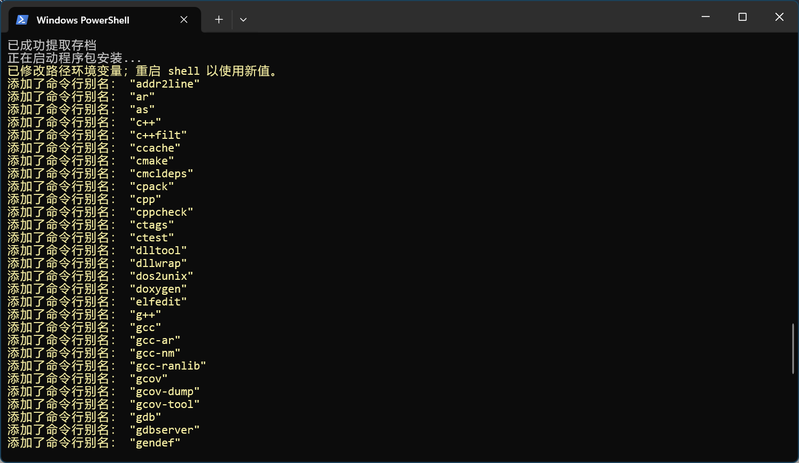
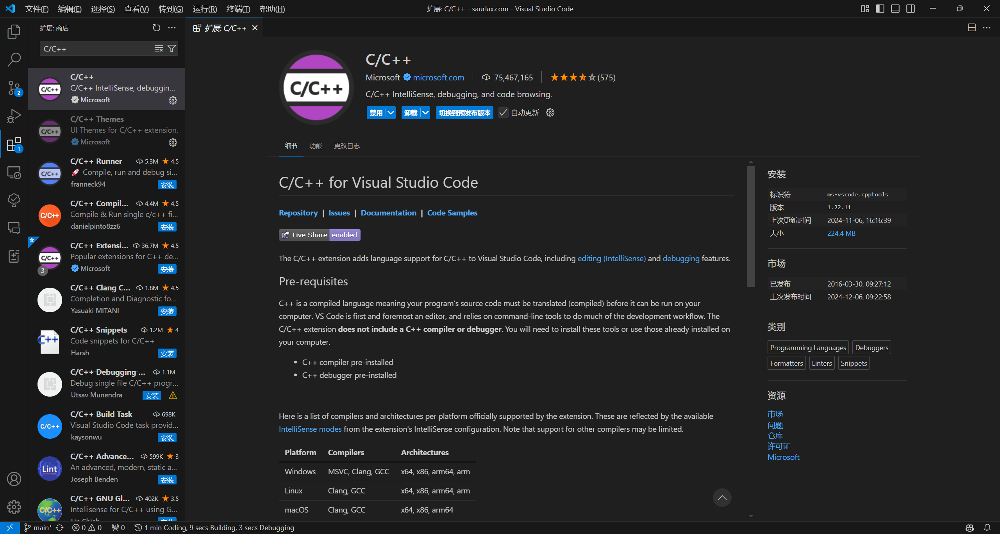
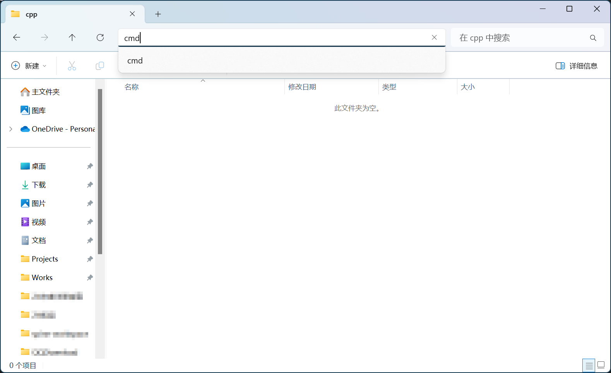
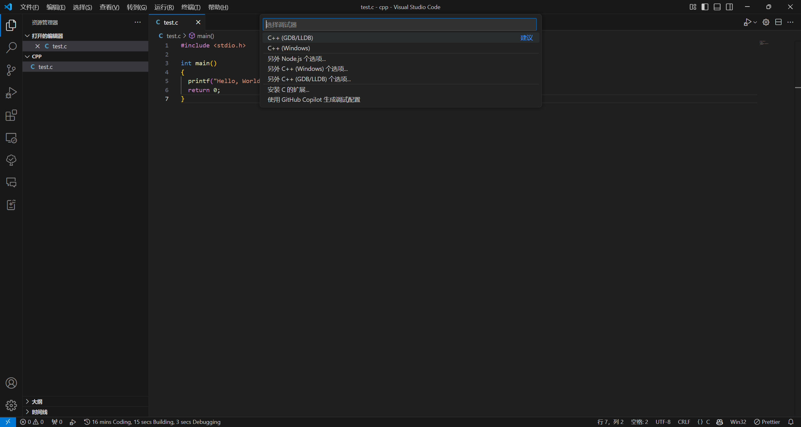

> 本教程仅适用于 Windows 10 及以上系统。

## 安装 Winlibs 和 VSCode

首先，按下 `Win + R` 组合键，输入 `cmd` 并按下回车键，打开命令提示符。

然后输入以下指令安装 winlibs：

```bash
winget install BrechtSanders.WinLibs.MCF.UCRT
```



然后前往 [VSCode 官网](https://code.visualstudio.com/) 下载并安装 VSCode。

安装完成后，打开 VSCode，打开扩展商店，搜索并安装 `C/C++` 扩展。

如果 VSCode 是英文的话，同样在扩展商店中搜索安装 `Chinese (Simplified) Language Pack for Visual Studio Code` 扩展即可。



## 配置 C/C++ 开发环境

选择好一个文件夹作为你以后存放代码的地方，然后在 VSCode 中打开这个文件夹。

- 可以把这个文件夹拖到 VSCode 窗口中来打开文件夹。
- 也可以点击左上角的 `文件` -> `打开文件夹` 来打开文件夹。
- 还可以在对应的目录的地址栏中输入 `cmd` 并按下回车键，然后在命令提示符中输入 `code .` 来打开文件夹。
  

打开文件夹后，新建一个 C 或 C++ 文件，输入以下代码：

```c
#include <stdio.h>

int main() {
    printf("Hello, World!\n");
    return 0;
}
```

然后按下 `F5` 键，选择 `C++ (GDB/LLDB)`，之后选择第一个 `C/C++ gcc.exe 生成和调试活动文件`，等待片刻，应该就可以看到成功在终端中输出 `Hello, World!` 了。如果是 C++ 文件的话，显示的应该是 `C/C++: g++.exe 生成和调试活动文件`。

如果出错，检查一下源文件路径是否有中文，需要将项目文件夹放在英文路径下，且源文件名不要有中文。



## 常用技巧

- 使用 `Shift + Alt + F` 可以快速格式化代码，让你的代码更加整洁美观。
- 使用 `Ctrl + /` 可以快速注释或取消注释一行代码。
- 使用 `Ctrl + ~` 可以快速打开或关闭终端。

如果你觉得默认的格式化样式不满意，可以在项目根目录下新建一个 `.clang-format` 文件，然后在里面写入你想要的格式化样式，比如：

```json
basedOnStyle: Google
```

可以让你的代码的格式化风格变成 Google 风格（括号换行更加紧凑，而不是单独占一行）。
